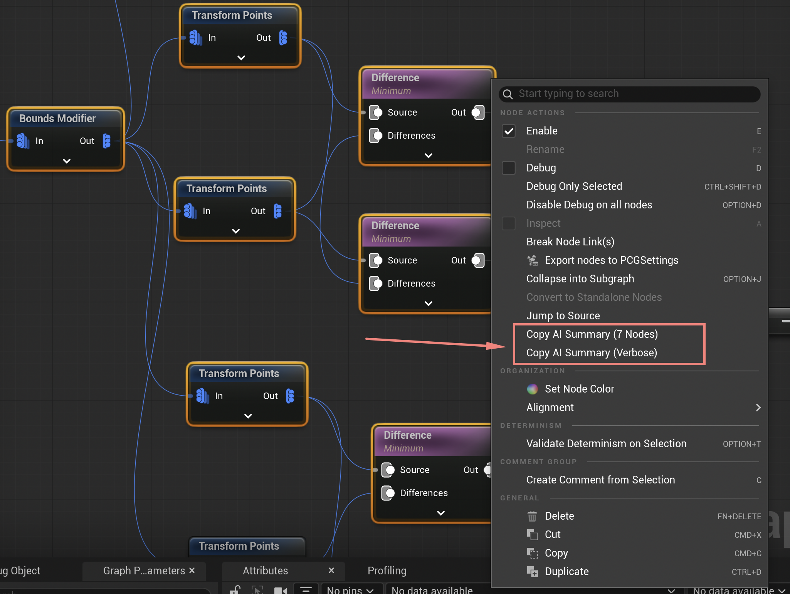

# Blueprint AI Summarizer



Blueprint AI Summarizer is an editor-only Unreal Engine plugin that copies AI-readable summaries of selected graph nodes.

It is made for the common workflow where copying raw node text into an AI chat is too large, noisy, or awkward. Select only the nodes you want to discuss, right-click one of them, and choose **Copy AI Summary**.

Despite the name, the plugin works through Unreal's graph editor menu extender. It can summarize Blueprint graphs and other editor graphs that use `SGraphEditor`, such as PCG graphs.

## Features

- Adds **Copy AI Summary** to the graph node right-click menu.
- Adds **Copy AI Summary (Verbose)** when you need the detailed pin-level output.
- Summarizes only the currently selected nodes, not the entire asset or graph.
- Supports multi-node selections.
- Separates selected-node flow from external inputs and external outputs.
- Includes node class, readable node title, node id, comments, links, and explicit/default pin values.
- Falls back to the node you right-clicked if the editor does not expose a multi-selection.
- Editor-only module; it is not packaged into your game runtime.
- Uses Unreal's cross-platform clipboard API, so there is no platform-specific Windows or macOS code.

## Output Modes

**Copy AI Summary** produces a compact topology-focused summary:

- `Nodes`: selected nodes, ids, classes, and comments.
- `Flow`: links between selected nodes.
- `External Inputs`: links entering the selection from unselected nodes.
- `External Outputs`: links leaving the selection to unselected nodes.
- `Set Parameters`: unlinked input pins that have explicit/default values.

**Copy AI Summary (Verbose)** keeps the older detailed format. It lists pins, pin types, default values, and selected/external links per node. Use this when the compact output hides details you need for debugging.

## Compatibility

Built and tested with Unreal Engine 5.7 on macOS.

Expected to work with Unreal Engine 5.x editor builds where these public editor modules are available:

- `GraphEditor`
- `Kismet`
- `UnrealEd`
- `Slate`
- `SlateCore`

The plugin is editor-only and targets Unreal Editor, not packaged runtime builds.

Notes on version support:

- **Confirmed:** Unreal Engine 5.7 on macOS.
- **Expected:** Unreal Engine 5.0 through 5.6 on macOS and Windows, because the plugin uses public editor APIs that exist across UE5.
- **Not tested:** Unreal Engine 4.x and Linux.

For Windows, use a normal C++ Unreal project setup with Visual Studio and the workload required by your Unreal Engine version.

## Installation

Copy this folder into your project:

```text
YourProject/
  Plugins/
    BlueprintAISummarizer/
```

Then:

1. Open the `.uproject` file or regenerate project files.
2. Build your editor target.
3. Open Unreal Editor.
4. Enable the plugin if Unreal asks.

You can also add it to your `.uproject` plugin list:

```json
{
  "Name": "BlueprintAISummarizer",
  "Enabled": true,
  "TargetAllowList": [
    "Editor"
  ]
}
```

## Engine Or Project Plugin

You can install it as either:

- A project plugin: `YourProject/Plugins/BlueprintAISummarizer`
- An engine/editor plugin: `Engine/Plugins/Marketplace/BlueprintAISummarizer` or another editor plugin folder

Project plugin installation is easiest for a single project. Engine/editor plugin installation is useful if you want the command available across multiple projects.

## Usage

1. Open a graph editor, such as a Blueprint graph or PCG graph.
2. Select one or more nodes.
3. Right-click one selected node.
4. Choose **Copy AI Summary** for compact output.
5. Choose **Copy AI Summary (Verbose)** for detailed pin-level output.
6. Paste the clipboard contents into your AI chat.

If no multi-selection can be found, the command falls back to the node you right-clicked.

## Example Output

```text
Blueprint Node AI Summary
=========================
Graph: PCGEditorGraph_0
SelectedNodes: 8

Nodes:
- Transform Points [PCGEditorGraphNode_3] class=PCGEditorGraphNode
- Difference [PCGEditorGraphNode_5] class=PCGEditorGraphNode
- Transform Points [PCGEditorGraphNode_4] class=PCGEditorGraphNode
- Difference [PCGEditorGraphNode_6] class=PCGEditorGraphNode
- Union [PCGEditorGraphNode_11] class=PCGEditorGraphNode
- To Point [PCGEditorGraphNode_13] class=PCGEditorGraphNode
- Transform Points [PCGEditorGraphNode_7] class=PCGEditorGraphNode
- Difference [PCGEditorGraphNode_9] class=PCGEditorGraphNode

Flow:
- Transform Points [PCGEditorGraphNode_3].Out -> Difference [PCGEditorGraphNode_5].Source
- Transform Points [PCGEditorGraphNode_3].Out -> Difference [PCGEditorGraphNode_6].Differences
- Difference [PCGEditorGraphNode_5].Out -> Union [PCGEditorGraphNode_11].In
- Transform Points [PCGEditorGraphNode_4].Out -> Difference [PCGEditorGraphNode_5].Differences
- Transform Points [PCGEditorGraphNode_4].Out -> Difference [PCGEditorGraphNode_6].Source
- Difference [PCGEditorGraphNode_6].Out -> Union [PCGEditorGraphNode_11].In2
- Union [PCGEditorGraphNode_11].Out -> To Point [PCGEditorGraphNode_13].In
- Transform Points [PCGEditorGraphNode_7].Out -> Difference [PCGEditorGraphNode_9].Source
- Difference [PCGEditorGraphNode_9].Out -> Union [PCGEditorGraphNode_11].In3

External Inputs:
- Bounds Modifier [PCGEditorGraphNode_2].Out -> Transform Points [PCGEditorGraphNode_3].In
- Bounds Modifier [PCGEditorGraphNode_2].Out -> Transform Points [PCGEditorGraphNode_4].In
- Difference [PCGEditorGraphNode_10].Out -> Union [PCGEditorGraphNode_11].In4
- Bounds Modifier [PCGEditorGraphNode_2].Out -> Transform Points [PCGEditorGraphNode_7].In
- Transform Points [PCGEditorGraphNode_8].Out -> Difference [PCGEditorGraphNode_9].Differences

External Outputs:
- To Point [PCGEditorGraphNode_13].Out -> Transform Points [PCGEditorGraphNode_12].In
- Transform Points [PCGEditorGraphNode_7].Out -> Difference [PCGEditorGraphNode_10].Differences

Set Parameters:
- <none with explicit values>
```

## Notes

- This is a summarizer, not a lossless graph exporter.
- Compact mode intentionally omits unlinked pins that have no explicit/default value.
- Verbose mode is better when you need full pin-level context.
- Large selections are capped to keep clipboard output usable.

## License

MIT. See [LICENSE](LICENSE).
